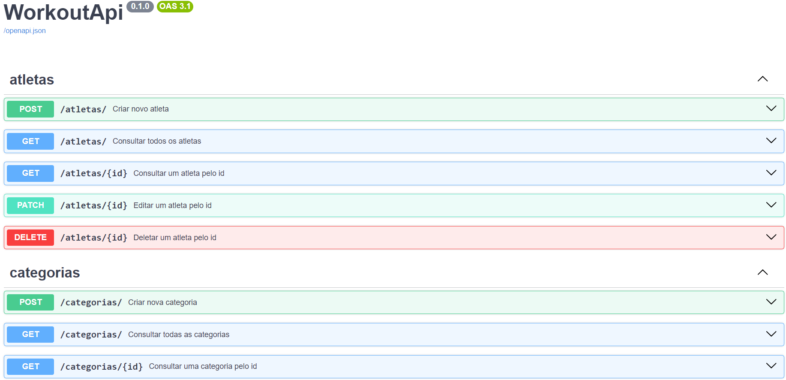

# Projeto de API em Python com FastAPI

Este projeto foi desenvolvido para criar uma API com a linguagem Python, trabalhando os principais verbos HTTP.

## Techs usadas

- FastAPI
- Alembic
- Pydantic
- SQLAlchemy
- Uvicorn
- FastAPI Pagination
- Docker
- DBeaver
- Postman
